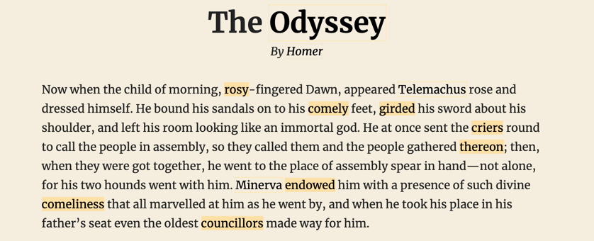
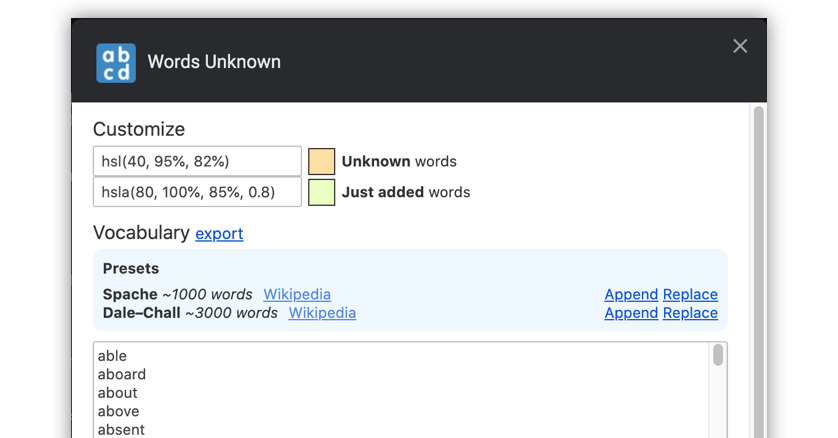

> Learn English while browsing the web by highlighting words that you don't know yet.

⚠️ **Work in progress** – current version is a pure MVP, but useful already!

## How to use

- Click on extension icon to activate it
- Extension will parse the website and highlight words you don't have in your dictionary
- Click on highlighted words to add them to the dictionary
  - If the highlight is part of the link, hold <kbd>cmd</kbd> key while clicking to open the link instead of adding the word.
  - Hold the <kbd>d</kbd> key while clicking to open the dictionary instead of adding the word.
  - Click again on an added word to remove it from dictionary

### Features (and future futures)

- Customizable highlight colors
- Capitalized words are subtly outlined instead of highlighted with background color
- Dictionary presets
- Export to file for backup

#### Planned (contributions welcome 🙏)

- Add "n" most frequend words
  - [norvig.com/mayzner](http://norvig.com/mayzner.html)
  - [pastebin.com/anKcMdvk](https://pastebin.com/anKcMdvk)
  - [en.wiktionary.org/wiki/Wiktionary:Frequency_lists#Project_Gutenberg](https://en.wiktionary.org/wiki/Wiktionary:Frequency_lists#Project_Gutenberg)
  - [en.wiktionary.org/wiki/Wiktionary:Frequency_lists](https://en.wiktionary.org/wiki/Wiktionary:Frequency_lists)
- Customizable everything
- Matching by stem (optional)
  - [github.com/words/stemmer](https://github.com/words/stemmer)
- Optimized data structure for storing dictionary
  - [github.com/zandaqo/structurae](https://github.com/zandaqo/structurae)
  - [johnresig.com/blog/javascript-trie-performance-analysis/](https://johnresig.com/blog/javascript-trie-performance-analysis/)
- Undo/Redo
- History
- Root element selection
- Open in dictionary
- Turning on/off

### About the name

Word play on amazing [Anthony Bourdain's Parts Unknown](https://en.wikipedia.org/wiki/Anthony_Bourdain:_Parts_Unknown)

### Tech stack notes

- Options UI
  - [github.com/alpinejs/alpine](https://github.com/alpinejs/alpine) – wanted to try it out, it did it's job, but I would use Vue next time.

### Attributions

- Presets / Familiar words
  - [github.com/words/spache](https://github.com/words/spache)
  - [github.com/words/dale-chall](https://github.com/words/dale-chall)
- Example
  - [github.com/matejlatin/Gutenberg](https://github.com/matejlatin/Gutenberg)
